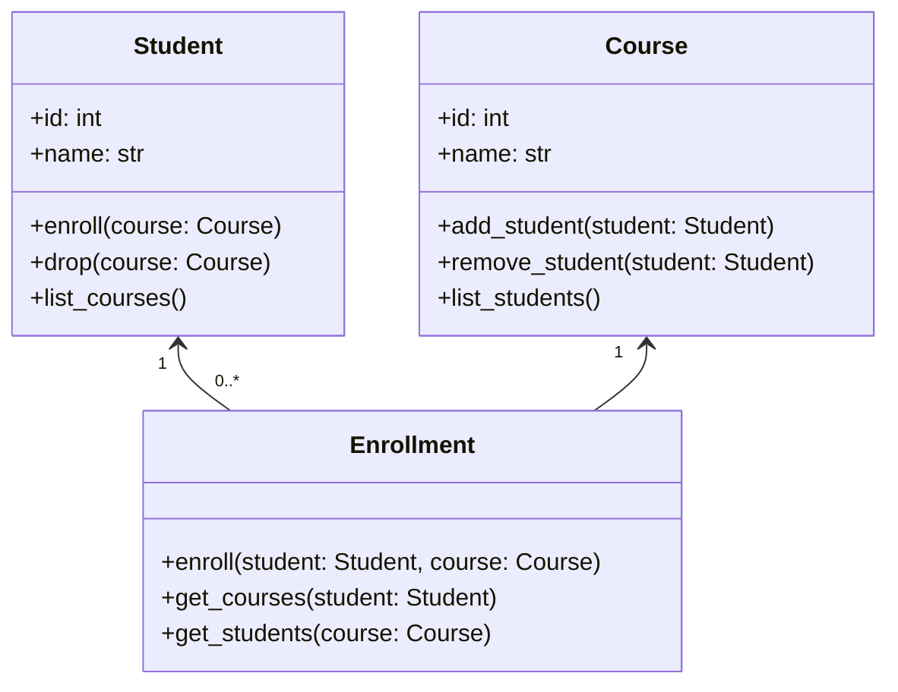

# UML-диаграмма для системы управления студентами

Этот документ содержит диаграмму классов UML для системы управления студентами. Диаграмма использует синтаксис Mermaid, поддерживаемый GitHub, для отображения классов и их взаимотношений.

